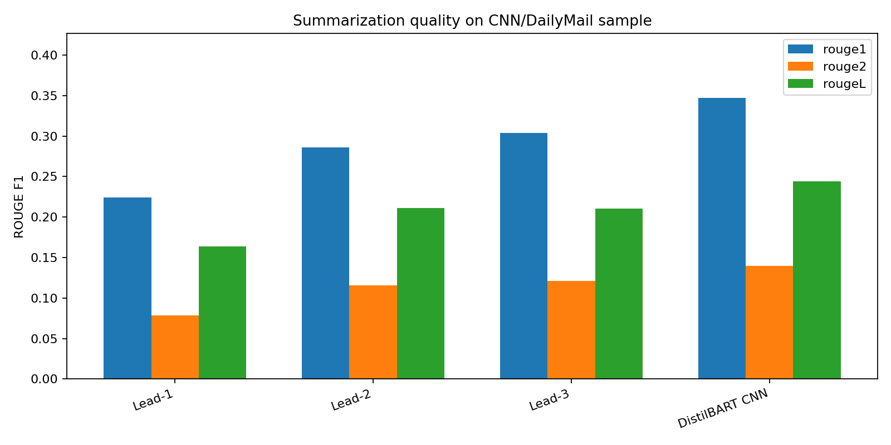
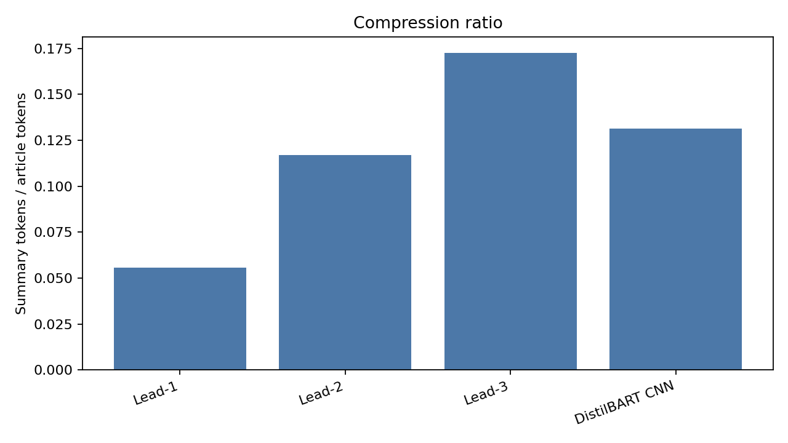
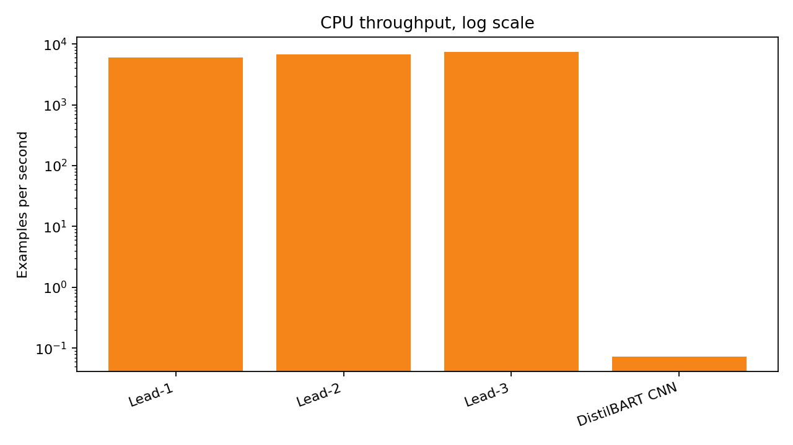
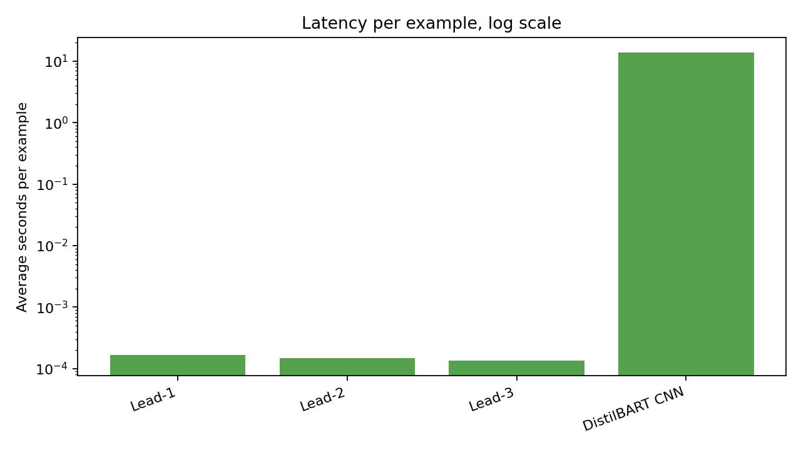

# Transformer Text Summarization

Long news articles are useful, but nobody always has time to read the whole
thing. A summarizer tries to do the same job a friend would do if you asked,
"What happened here?"

The hard part is that a short summary can still be bad. It might skip the main
fact. It might copy the first few lines and miss the point. It might even sound
right while saying something the article never said.

This repo is my way of testing that problem. I used CNN/DailyMail news
articles, compared simple baselines with a Transformer summarizer, measured the
results, and saved the tables and charts.

I also wrote a small Transformer in NumPy. That part isn't meant to beat
DistilBART or BART. It's there so I can explain what happens inside the model:
attention, masks, encoder-decoder flow, and the final token scores.

## Made-Up Example

This example is fictional. It's just here to make the idea clear.

Say an article says:

> A city made a dashboard for bus delays. The dashboard found that two routes
> cause most evening delays, so the city plans to add more buses there.

A weak summary might say:

> The city made a bus dashboard.

That's short, but it misses the useful part.

A better summary would say:

> The city found two bus routes causing most evening delays and plans to add
> more buses there.

That's the real question in this project: did the summary keep the thing a
reader came for?

## What I Checked

Main run:

- Dataset: `abisee/cnn_dailymail`
- Config: `1.0.0`
- Split: `test`
- Sample: first 24 test examples
- Device: CPU
- Transformer model: `sshleifer/distilbart-cnn-6-6`
- Batch size for DistilBART: 2

I also ran bigger baseline checks and a 50-example DistilBART review run. Those
are saved separately so the small run doesn't pretend to be a full benchmark.

## Main Result

| Model | ROUGE-1 | ROUGE-2 | ROUGE-L | Compression | Latency sec/ex | Ex/sec |
|---|---:|---:|---:|---:|---:|---:|
| Lead-1 baseline | 0.2242 | 0.0787 | 0.1636 | 0.0558 | 0.0002 | 5957.7003 |
| Lead-2 baseline | 0.2860 | 0.1156 | 0.2110 | 0.1169 | 0.0001 | 6679.8408 |
| Lead-3 baseline | 0.3038 | 0.1212 | 0.2105 | 0.1727 | 0.0001 | 7350.4640 |
| DistilBART CNN | 0.3470 | 0.1399 | 0.2442 | 0.1313 | 13.6741 | 0.0731 |

DistilBART scored best on ROUGE in this small run. It was also slow on CPU.

Lead-3 is still a useful comparison. News articles often put the main facts
near the start, so a simple "first three sentences" baseline can be harder to
beat than it sounds.

The speed chart uses a log scale because the lead baselines are just slicing
sentences. That isn't the same kind of work as neural model inference.

## Bigger Evidence Files

| File | What it proves |
|---|---|
| `outputs/tables/baseline_500_summary.csv` | Lead-1/2/3 on 500 CNN/DailyMail examples |
| `outputs/metrics/distilbart_50_review/` | 50-example DistilBART CPU run for review |
| `outputs/error_analysis/distilbart_50_manual_review_template.csv` | 50 rows ready for manual error review |
| `outputs/content_discovery/distilbart_50/` | tags and similar-item candidates from generated summaries |
| `outputs/tables/model_run_status.csv` | which bigger claims are done and which are not |

## Charts









## Main Files

| Path | What it does |
|---|---|
| `src/hf_benchmark.py` | Runs Hugging Face summarization models on CNN/DailyMail rows |
| `src/run_benchmark_suite.py` | Runs repeatable multi-model benchmark suites |
| `src/build_results.py` | Builds baseline results, tables, charts, and reports |
| `src/create_error_review_template.py` | Creates a manual review sheet |
| `src/summarize_error_review.py` | Summarizes a filled review sheet |
| `src/content_discovery.py` | Creates summary tags and similar-item candidates |
| `src/scratch_transformer.py` | Small NumPy Transformer from scratch |
| `tests/` | Unit tests |

## Run It

Install dependencies:

```powershell
python -m venv .venv
.\.venv\Scripts\Activate.ps1
pip install -r requirements.txt
```

Run tests:

```powershell
python -m unittest discover -s tests
```

Run the small model benchmark:

```powershell
python -m src.hf_benchmark --model sshleifer/distilbart-cnn-6-6 --dataset abisee/cnn_dailymail --config 1.0.0 --split test --sample-size 24 --batch-size 2 --max-new-tokens 96
```

Build tables and charts:

```powershell
python -m src.build_results --run-baselines --sample-size 24
```

## What I Still Wouldn't Claim

I wouldn't call this a final summarization benchmark yet.

Why:

- The neural model run is still small.
- BART-large-CNN and PEGASUS are not run yet.
- The manual error review sheet is created, but not filled.
- The content-discovery bridge creates tags and neighbors, but it doesn't prove
  search got better.

The next real upgrade is a 500-example neural run on a GPU, then a filled
50-example error review.
