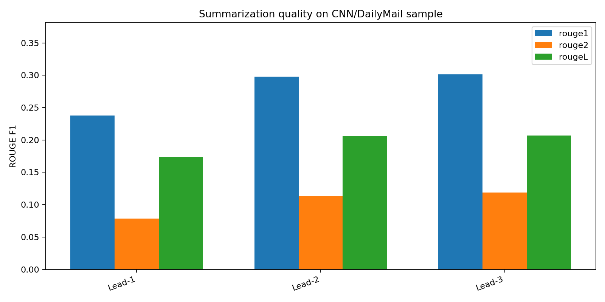
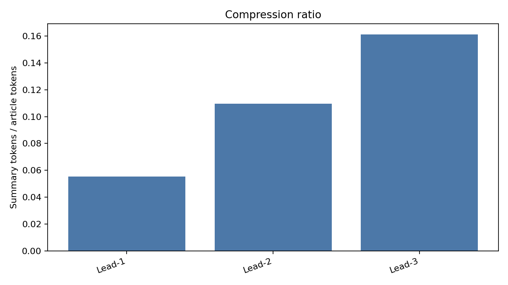
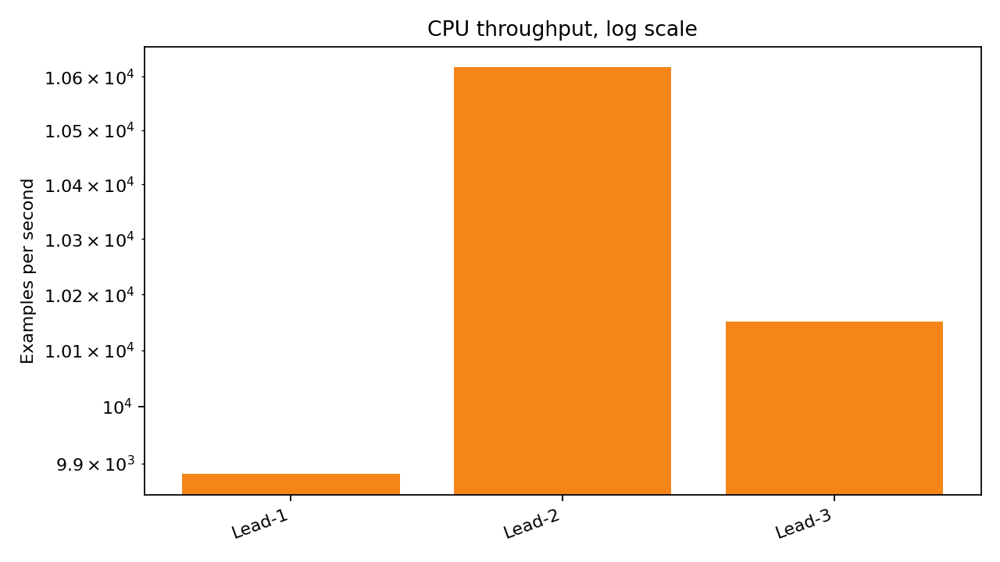
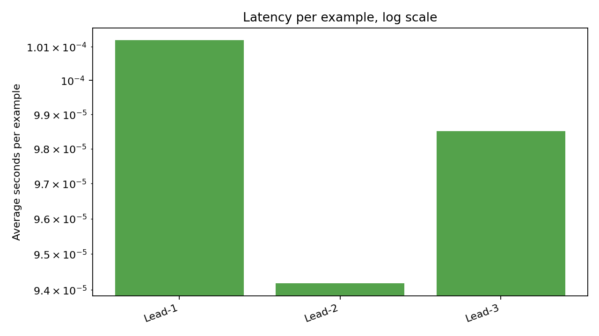

# 500-Example Baseline Results

I ran Lead baselines on `abisee/cnn_dailymail` with `500` test examples.

This report sets a baseline before a bigger Transformer run.

## Metrics

| Model | ROUGE-1 | ROUGE-2 | ROUGE-L | Compression | Latency sec/ex | Ex/sec |
|---|---:|---:|---:|---:|---:|---:|
| Lead-1 | 0.2377 | 0.0785 | 0.1734 | 0.0554 | 0.0001 | 9881.2667 |
| Lead-2 | 0.2981 | 0.1126 | 0.2058 | 0.1096 | 0.0001 | 10618.0783 |
| Lead-3 | 0.3014 | 0.1187 | 0.2070 | 0.1612 | 0.0001 | 10151.2331 |

## Charts

## What I Take From This Run

- Lead-3 is the strongest Lead baseline here.
- Lead-2 is close, with a lower compression ratio.
- These baselines are very fast because they only slice sentences.
- This gives a fairer baseline for a future Transformer run.
